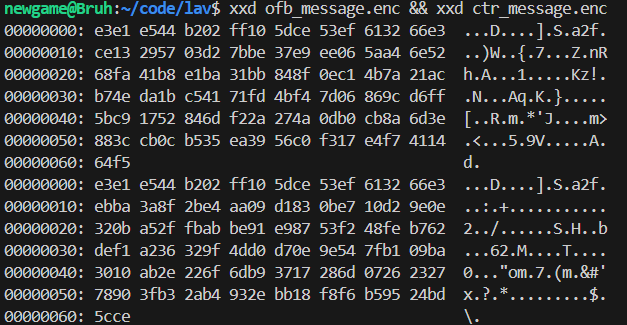
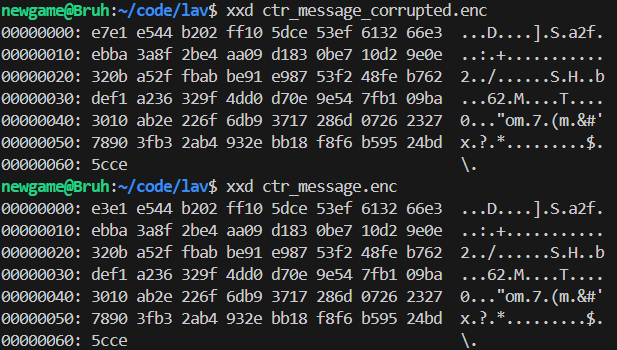
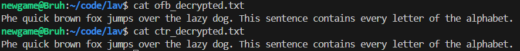

# Lab #2,20110432, Vo Duc Hoang Phi, INSE330380E_24_1_03FIE
# Task 2: Encrypting large message
## 1. Encrypt the message file aes-cipher in CTR and OFB modes.
First, we need to create a message file
```sh
echo "The quick brown fox jumps over the lazy dog. This sentence contains every letter of the alphabet." > message.txt
```
*This creates **message.txt** and put the string in that file* <br> <br>
Second, we need to have 2 128-bit hex strings for key value and initial vector. We can use any chat bot to do that. <br>

**Key value**
```
4f2a1d3e5b6c7f8a9b0c1d2e3f4a5b6c
```

**Initial vector**
```
a1b2c3d4e5f67890abcdef1234567890
```
### Encrypt the message

**Encrypt the message with CTR mode**

```sh
openssl aes-128-ctr -e -in message.txt -out ctr_message.enc -K 4f2a1d3e5b6c7f8a9b0c1d2e3f4a5b6c -iv a1b2c3d4e5f67890abcdef1234567890 
````

**Encrypt the meesage with OFB mode**
```sh
openssl aes-128-ofb -e -in message.txt -out ofb_message.enc -K 4f2a1d3e5b6c7f8a9b0c1d2e3f4a5b6c -iv a1b2c3d4e5f67890abcdef123456
7890 
```
After the encryption, we now have 2 encrypted file, **ofb_message.enc** and **ctr_message.enc**. We can observe the contents within 2 files with xxd command.
```sh
xxd ofb_message.enc && xxd ctr_message.enc
```

<br>
From this we can clearly see that the first 16 bytes (128 bits) are identical but the rest is diffirent

## 2. Corrupt the enctypted files
**To flip the 6th bit of the encrypted file, we have to follow few steps**
### Step 1, copy first corrupted byte
```sh
printf "\x$(printf '%02x' $((0x$(dd if=ctr_message.enc bs=1 count=1 2>/dev/null | xxd -p) ^ 0x04)))" | dd of=ctr_message_corrupted.enc bs=1 count=1 conv=notrunc
```
This command extract the first byte of **ctr_message.enc** (input file) and XOR it with 0x04 (0000 0100) to make the 6th bit flip and the result will be written to **ctr_message_corrupted.enc** (output file). <br><br>
Now we will copy the remaining content in **ctr_message.enc** to **ctr_message_corrupted.enc**.
### Step 2, copy the rest of the file
```sh
dd if=ctr_message.enc of=ctr_message_corrupted.enc bs=1 skip=1 seek=1 conv=notrunc
```
*We copy but skip the first byte since it has been copied in the previous step.* <br>
### Step 3, Verify if the encypted file is handled correctly using xxd.
```sh
xxd ctr_message_corrupted.enc
```
```sh
xxd ctr_message.enc
```

<br>
We can see the different is in the first byte: e7 (1110 0111) and e3 (1110 0011)
<br><br>
### Repeat with ofb_message.enc.
```sh
printf "\x$(printf '%02x' $((0x$(dd if=ofb_message.enc bs=1 count=1 2>/dev/null | xxd -p) ^ 0x04)))" | dd of=ofb_message_corrupted.enc bs=1 count=1 conv=notrunc
```
```sh
dd if=ofb_message.enc of=ofb_message_corrupted.enc bs=1 skip=1 seek=1 conv=notrunc
```

## 3. Decrypt corrupted files
**Decrypt the corrupted files (CTR mode)**
```sh
openssl aes-128-ctr -d -in ctr_message_corrupted.enc -out ctr_decrypted.txt -K 4f2a1d3e5b6c7f8a9b0c1d2e3f4a5b6c -iv a1b2c3d4e5f67890abcdef1234567890 
```
**Decrypt the corrupted files (OFB mode)**
```sh
openssl aes-128-ofb -d -in ofb_message_corrupted.enc -out ofb_decrypted.txt -K 4f2a1d3e5b6c7f8a9b0c1d2e3f4a5b6c -iv a1b2c3d4e5f67890abcdef1234567890 
```
*The **Key** and **Initial vector** are the same as above* <br> <br>
**Read the contents of decrypted files**
```sh
cat ofb_decrypted.txt
```
```sh
cat ctr_decrypted.txt
```

<br>
The first letter, got corrupted while the remaining is still intact
### Conclusion
Both CTR and OFB in this case works the same, only the byte containing the corruption is not recovered, however, the remaining is still intact and so is the 16-byte block containing the corruption.